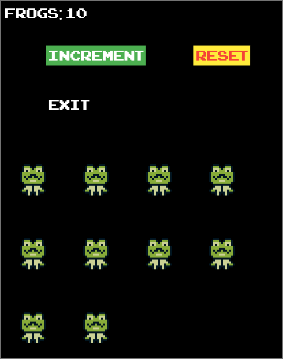

# flame_pref

Flame example using [shared_preferences](https://pub.dev/packages/shared_preferences)
to persist game score.

## Features

* maintain count on hot restart
* maintain count on full quit
* exit on Android and Windows
* reset counter
* redraw on screen resize
